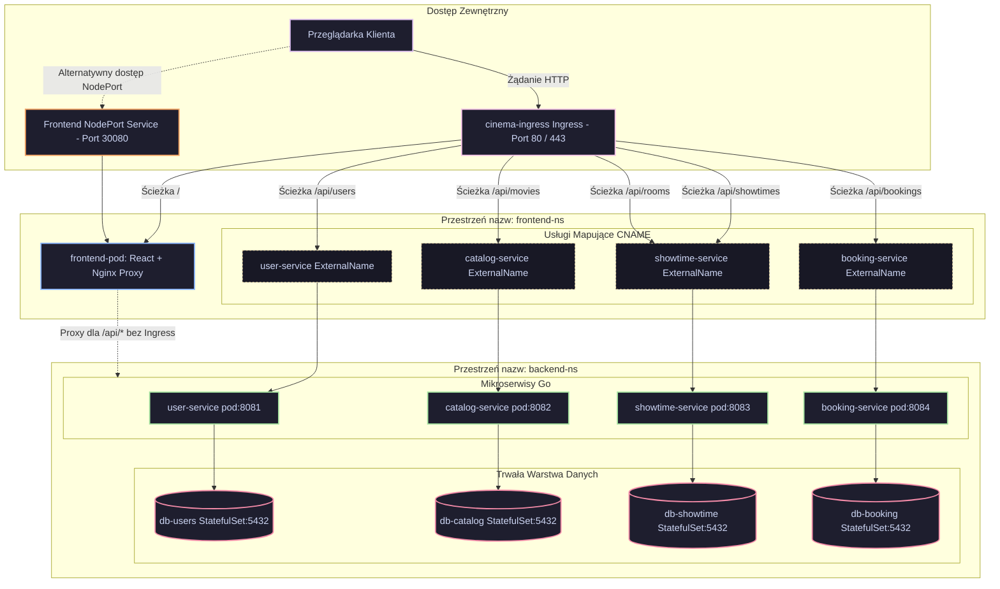

# Cinema System - Mikroserwisy, Docker i Docker Compose

Projekt prezentuje system rezerwacji kinowych oparty o mikroserwisy:

- `user-service`
- `catalog-service`
- `showtime-service`
- `booking-service`
- `frontend`

Całość uruchamiana jest przez Docker Compose.

## Architektura

System składa się z pięciu głównych komponentów: frontendu oraz czterech mikroserwisów backendowych. Każdy z mikroserwisów odpowiada za osobną domenę biznesową i posiada własną, niezależną bazę danych PostgreSQL.

- **Frontend**: Aplikacja React + Vite serwowana przez zabezpieczony serwer Nginx.
- **Go Microservices**: Cztery wydajne serwisy backendowe napisane w języku Go (`user-service`, `catalog-service`, `showtime-service`, `booking-service`).
- **PostgreSQL StatefulSets**: Dedykowane bazy danych dla każdego serwisu, gwarantujące pełną izolację danych.
- **Db Migrations**: Kontenery automatycznie wykonujące migracje schematów baz danych przy starcie.


## Uruchomienie lokalne (dev)

```powershell
docker compose up -d --build
docker compose ps
```

Frontend jest dostępny pod adresem:

- `http://localhost:8080`

## Wykonanie wymagań (punkty 2-6)

### Punkt 2: Dockerfile i dobre praktyki

Zrealizowano Dockerfile dla wszystkich zaplanowanych mikroserwisów i frontendu, z uwzględnieniem:

- multi-stage build
- oddzielenia etapu build/runtime
- uruchamiania jako non-root (backendy)
- plików `.dockerignore` dla kontekstów builda

Zrzut ekranu Dockerfile dla `catalog-service`:


### Punkt 3: Multiarch + DockerHub + SBOM

Build i push obrazów przygotowany przez `Makefile`:

- `docker buildx build --platform linux/amd64,linux/arm64`
- `--sbom=true`
- `--push` (dla publikacji do DockerHub)

Użyte targety:

```powershell
make build-all REPO=<dockerhub_namespace> VERSION=<tag>
make push-all REPO=<dockerhub_namespace> VERSION=<tag>
```

Zrzuty ekranu potwierdzajace wykonanie punktu 3:

- Fragment `Makefile` z targetami buildx (`linux/amd64,linux/arm64`, `--sbom=true`, `--push`):


- Widok repozytoriow obrazow na DockerHub:


- Szczegoly obrazu `frontend` na DockerHub (manifest list z dwiema architekturami):


Na powyzszym zrzucie widac, ze obraz `frontend` jest wieloarchitekturowy i zawiera `linux/amd64` oraz `linux/arm64`.

### Punkt 4: Analiza podatności (Trivy)

Wykonano skany obrazów.

Wynik: wszystkie wykonane skany wykazały `0` podatności (`0` HIGH i `0` CRITICAL).

Zrzuty potwierdzające:

- 
- 
- 
- 
- 

### Punkt 5: Deweloperski docker-compose

Plik `docker-compose.yaml` zawiera praktyki wspierające utrzymanie i uruchamianie projektu:

Celowo pominieto pole `version`, poniewaz w Docker Compose V2 obecny silnik je ignoruje (pole jest przestarzale/obsolete).

- jawnie zdefiniowaną sieć (`cinema-net`)
- named volumes dla trwałości danych
- healthcheck dla baz danych
- `depends_on` z warunkami startu
- limity zasobów (`deploy.resources.limits`)
- polityki restartu (`restart: unless-stopped`, migracje: `restart: "no"`)

Zrzut ekranu pokazujacy poczatek konfiguracji Compose:


### Punkt 6: Graficzna reprezentacja aplikacji

Reprezentacja została wygenerowana narzędziem `compose-viz` i zapisana jako:

- `docs/artifacts/compose-viz.svg`


---

# Zadanie projektowe 2

### Schemat Działania i Przepływu Ruchu w Klastrze Kubernetes

Poniższy schemat Mermaid przedstawia pełną architekturę sieciową systemu w Kubernetes, obrazując trasowanie żądań zewnętrznych przez Ingress oraz alternatywną ścieżkę NodePort, a także komunikację między przestrzeniami nazw (`frontend-ns` i `backend-ns`):



Szczegółowy opis techniczny zaawansowanych mechanizmów bezpieczeństwa, limitów oraz reguł orkiestracji znajduje się również w dedykowanym pliku: **DODATKOWE.md**

---

## Zaawansowana, deklaratywna architektura Kubernetes dla projektu Cinema System

W tej sekcji opisano zaawansowaną architekturę orkiestracji kontenerów w wielowęzłowym środowisku Kubernetes, wdrożoną w projekcie **cinema-system** w celach zapewnienia wysokiej niezawodności, skalowalności i pełnego bezpieczeństwa chmurowego.

### 1. Podział na przestrzenie nazw (Namespaces)

W celu zachowania izolacji architektonicznej i ograniczenia uprawnień poszczególnych komponentów (zasada najmniejszych uprawnień), system został rozdzielony na dwie dedykowane, niestandardowe przestrzenie nazw:

*   **`frontend-ns` (Przestrzeń użytkownika i routerów):**
    Tutaj wdrażany jest publicznie dostępny frontend aplikacji oraz komponenty brzegowe sieci (Ingress Controller, Ingress, HPA, usługi typu `ExternalName` mapujące ruch). Wydzielenie tej strefy zapobiega bezpośredniemu dostępowi z zewnątrz klastra do newralgicznych komponentów bazodanowych w przypadku naruszenia bezpieczeństwa warstwy brzegowej.
*   **`backend-ns` (Przestrzeń logiki biznesowej i danych):**
    Przeznaczona dla 4 podstawowych mikrousług Go (`user-service`, `catalog-service`, `showtime-service`, `booking-service`) oraz 4 dedykowanych baz danych PostgreSQL. Ruch sieciowy w tej przestrzeni jest całkowicie odcięty od świata zewnętrznego i podlega ścisłej kontroli za pomocą polis sieciowych.

---

### 2. Wybór kontrolerów obciążeń (Workload Controllers)

Dobór odpowiednich kontrolerów w Kubernetes ma fundamentalne znaczenie dla odporności na awarie i zarządzania stanem:

*   **Deployment (Mikrousługi bezstanowe: `user`, `catalog`, `showtime`, `booking` oraz `frontend`):**
    Wszystkie aplikacje Go oraz serwer proxy Nginx są z natury bezstanowe. Wybrano dla nich kontroler `Deployment`, który zapewnia:
    *   **Skalowanie poziome:** Uruchomiono po **2 repliki** dla każdego backendu, co gwarantuje wysoką dostępność. Jeśli jeden pod ulegnie awarii, drugi natychmiast przejmuje ruch.
    *   **RollingUpdate (Bezprzestojowość):** Aktualizacje kodu odbywają się z zerowym czasem przestoju. Wdrożone parametry `maxSurge: 25%` oraz `maxUnavailable: 25%` (wyrażone procentowo) oznaczają, że w trakcie wdrażania nowej wersji systemu co najmniej 75% starych replik ciągle działa, a nowe pody są stopniowo włączane po przejściu testów gotowości (`readinessProbe`).
*   **StatefulSet (Bazy danych PostgreSQL: `db-users`, `db-catalog`, `db-showtime`, `db-booking`):**
    Bazy danych przechowują stan systemu. Stosowanie zwykłego `Deployment` groziłoby uszkodzeniem danych z powodu braku gwarancji kolejności uruchamiania i tożsamości sieciowej podów. Zastosowano kontroler `StatefulSet` z **1 repliką** dla każdej bazy danych, co zapewnia:
    *   **Unikalna tożsamość:** Każdy pod bazy danych otrzymuje stałą nazwę (np. `db-users-0`) i stały dysk, który nie zmienia się przy restartach.
    *   **volumeClaimTemplates:** Umożliwia stabilne, automatyczne powiązanie każdego podu ze swoim dedykowanym wolumenem PersistentVolume.
*   **DaemonSet (Uzasadnienie braku wyboru):**
    Kontroler `DaemonSet` uruchamia dokładnie jedną replikę poda na każdym węźle klastra. Jest on idealny dla agentów systemowych, takich jak Cilium CNI, zbieranie logów (Fluentd) czy monitoring (Prometheus Node Exporter). Ponieważ poszczególne mikroserwisy biznesowe powinny być dynamicznie harmonogramowane i skalowane przez Kubernetes w zależności od rzeczywistego obciążenia (a nie uruchamiane "na sztywno" na każdym fizycznym węźle bez względu na zasoby), **celowo nie wybrano kontrolera DaemonSet** dla żadnego z komponentów aplikacji.

---

### 3. Konfiguracja usług sieciowych (Services)

Wdrożono i zademonstrowano dwa podstawowe rodzaje abstrakcji usług sieciowych:

*   **ClusterIP (Wewnętrzna izolacja sieci):**
    Zastosowany dla wszystkich 4 mikrousług Go oraz ich baz danych wewnątrz przestrzeni `backend-ns`. Pody te nie posiadają zewnętrznych adresów IP i komunikują się wewnątrz sieci klastra za pomocą nazw domenowych CoreDNS o strukturze: `<nazwa-uslugi>.<przestrzen-nazw>.svc.cluster.local` (np. `db-users.backend-ns.svc.cluster.local`). Całkowicie eliminuje to twardo kodowane adresy IP z kodu aplikacji.
*   **NodePort (Ekspozycja brzegu klastra):**
    Frontend serwujący aplikację React został wystawiony za pomocą usługi typu `NodePort` (przypisany stały port `30080` na węzłach fizycznych klastra). Umożliwia to bezpośredni dostęp do serwera Nginx na adresie IP dowolnego węzła klastra Minikube, co jest idealne jako alternatywne wejście lub port diagnostyczny brzegu sieci.

---

### 4. Dostęp z zewnątrz klastra (Ingress)

Kierowanie ruchem publicznym HTTP z zewnątrz klastra realizowane jest przez deklaratywny zasób **Ingress** (z kontrolerem `ingress-nginx`) działający w przestrzeni `frontend-ns`:

*   **Path-based Routing (Trasowanie ścieżek HTTP):**
    Ingress analizuje adres URL zapytania przychodzącego z zewnątrz klastra i przekazuje ruch zgodnie z regułami:
    *   Ścieżka `/api/users` -> Usługa `user-service`
    *   Ścieżka `/api/movies` -> Usługa `catalog-service`
    *   Ścieżka `/api/showtimes` i `/api/rooms` -> Usługa `showtime-service`
    *   Ścieżka `/api/bookings` -> Usługa `booking-service`
    *   Ścieżka `/` -> Usługa `frontend` (serwująca pliki statyczne HTML/JS)
*   **Mapowanie Cross-Namespace (`ExternalName`):**
    Ponieważ Ingress może kierować ruch tylko do usług w tej samej przestrzeni nazw (`frontend-ns`), wdrożono wzorzec usług `ExternalName`. W `frontend-ns` utworzono usługi o identycznych nazwach jak te w backendzie, które przy zapytaniu zwracają rekord CNAME wskazujący na pełny adres mikrousługi w przestrzeni `backend-ns`. Dzięki temu routing na poziomie Ingress działa bezbłędnie i bez konieczności duplikowania podów.
*   **Ingress vs LoadBalancer / Gateway API (Uzasadnienie wyboru):**
    Wybrano mechanizm `Ingress` z kontrolerem `ingress-nginx` zamiast oddzielnych usług typu `LoadBalancer` dla każdego mikroserwisu. Usługa `LoadBalancer` tworzy osobny publiczny adres IP dla każdego serwisu (co w środowiskach chmurowych/wielowęzłowych generuje wysokie koszty i komplikuje zarządzanie). `Ingress` pozwala na skonsolidowanie całego ruchu pod **jednym publicznym adresem IP** i inteligentne trasowanie na podstawie ścieżek URL (path-based routing), co jest optymalne kosztowo i operacyjnie. Nowy standard `Gateway API` pominięto z uwagi na dodatkowy narzut konfiguracyjny (standard Ingress jest w pełni wystarczający i sprawdzony dla tej architektury).

---

### 5. Trwałość danych (PV, PVC, StorageClass)

Aby bazy danych PostgreSQL nie traciły danych podczas restartu podów, zaprojektowano wydajną warstwę składowania danych opartą na fizycznych dyskach węzłów:

*   **StorageClass (`local-storage`):**
    Klasa przechowywania danych wykorzystuje opcję `volumeBindingMode: WaitForFirstConsumer` (opóźnione wiązanie wolumenu). Sprawia to, że Kubernetes wstrzymuje się z przydziałem fizycznego wolumenu i powiązaniem z PVC do momentu, gdy planista (Scheduler) zdecyduje, na którym węźle fizycznym uruchomić dany pod bazy danych (uwzględniając reguły Affinity).
*   **Lokalne Wolumeny Persistent Volume (Local PV):**
    Dla każdej bazy danych zdefiniowano obiekt `PersistentVolume` z typem `local`, kierujący na fizyczny katalog na węźle `minikube` (np. `/mnt/data/db-users`). Zapewnia to maksymalną wydajność I/O (brak narzutu sieciowych dysków rozproszonych).
*   **PersistentVolumeClaim (PVC):**
    Generowane automatycznie z sekcji `volumeClaimTemplates` w specyfikacji `StatefulSet`. Gwarantuje to stałe, jednoznaczne powiązanie podu bazy danych ze swoim fizycznym dyskiem na konkretnym węźle.
*   **Blokada Wolumenów (`claimRef`):**
    Wszystkie cztery manifesty `PersistentVolume` zawierają sekcję `claimRef` wskazującą na konkretne roszczenie (PVC) w określonym namespace. To kluczowe zabezpieczenie chroni przed domyślnym, zachłannym przypisywaniem wolumenów lokalnych o tym samym rozmiarze do przypadkowych baz danych podczas restartu (np. sytuacja, w której baza użytkowników omyłkowo mountuje wolumen z danymi seansów kinowych).

---

### 6. Bezpieczne zarządzanie konfiguracją (ConfigMaps & Secrets)

Zgodnie z dobrymi praktykami 12-Factor App, oddzielono konfigurację aplikacji od kodu binarnego:

*   **ConfigMaps (Konfiguracja jawna):**
    Użyte do przechowywania plików migracji bazy danych `.sql` (np. `user-db-migrations`). Pliki te są deklaratywnie zapisane jako dane w obiekcie ConfigMap i montowane w kontenerach startowych (`initContainers`) jako wolumen w trybie tylko do odczytu, co umożliwia bezproblemowe przeprowadzenie migracji przy uruchomieniu aplikacji.
*   **Secrets (Dane wrażliwe):**
    Wszystkie hasła do baz danych, tokeny JWT (`JWT_SECRET`) oraz pełne parametry połączeń (`DATABASE_URL`) zostały odseparowane i wstrzyknięte poprzez obiekty typu `Secret`. Aplikacje Go pobierają je jako zmiennes środowiskowe zreferowane bezpośrednio w plikach wdrożeń (Deployment/StatefulSet).

---

### 7. Sondy kondycji i gotowości (Liveness & Readiness Probes)

Dla wszystkich pięciu mikroserwisów wdrożono mechanizmy samoleczenia (Self-healing) na poziomie kontenerów w celu automatycznej detekcji stanów zawieszenia oraz zapewnienia stabilności działania:

*   **Sonda Kondycji (Liveness Probe):**
    *   **Zastosowanie:** Zdefiniowana dla wszystkich aplikacji Go (porty `8081-8084`, ścieżka `/health`) oraz serwera Nginx frontendu.
    *   **Parametry:** `initialDelaySeconds: 10`, `periodSeconds: 10`.
    *   **Uzasadnienie:** Sonda cyklicznie odpytuje kontener. Jeśli aplikacja ulegnie zakleszczeniu (deadlock) lub wewnętrznej awarii, która uniemożliwi obsługę zapytań HTTP, Kubernetes automatycznie zrestartuje kontener, przywracając działanie usługi bez interwencji administratora.
*   **Sonda Gotowości (Readiness Probe):**
    *   **Zastosowanie:** Zdefiniowana dla aplikacji oraz frontendu (porty `8081-8084`, ścieżka `/health`).
    *   **Parametry:** `initialDelaySeconds: 5`, `periodSeconds: 5`.
    *   **Uzasadnienie:** Gwarantuje, że nowy pod nie otrzyma ruchu sieciowego od użytkowników przed pełnym zakończeniem inicjalizacji (np. zanim nawiąże stabilne połączenie z bazą danych i wczyta konfigurację). Jest to kluczowy element bezprzestojowego wdrażania (`RollingUpdate`) – stary pod jest wyłączany dopiero wtedy, gdy nowo utworzony pod zgłosi pełną gotowość.

### Dodatkowe mechanizmy
Konfiguracja 
- **Polityki sieciowej**
- **Limitów i przydziałów zasobów**
- **Reguł planowania podów (Pod Affinity & Anti-Affinity)**


