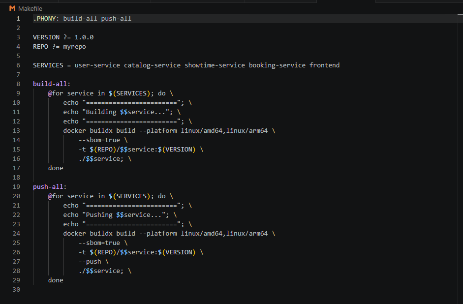
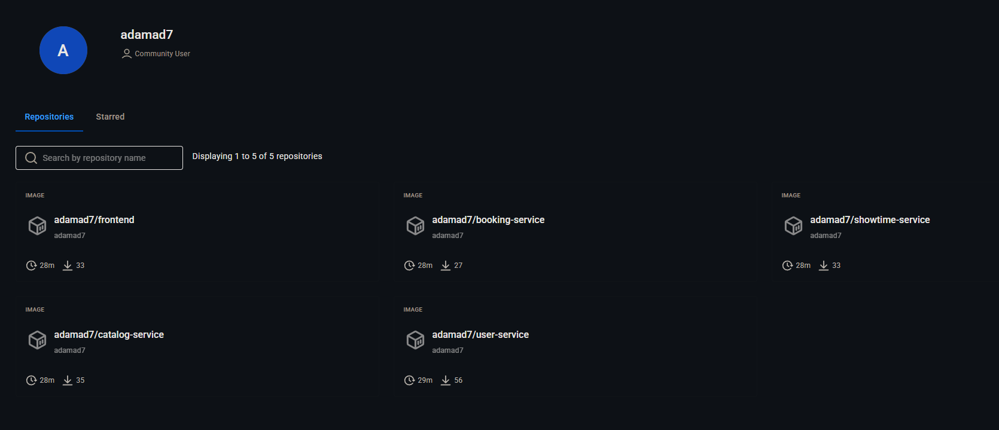
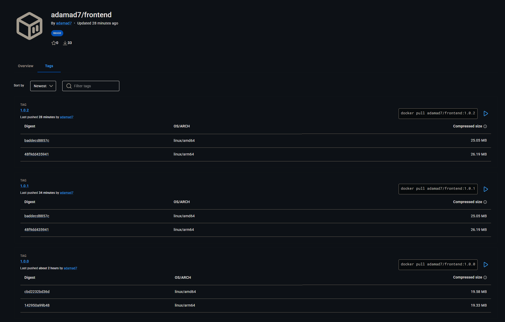
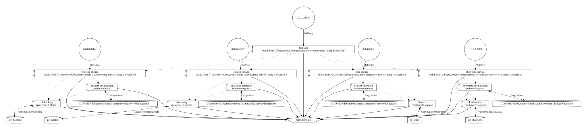

# Cinema System - Mikroserwisy, Docker i Docker Compose

Projekt prezentuje system rezerwacji kinowych oparty o mikroserwisy:

- `user-service`
- `catalog-service`
- `showtime-service`
- `booking-service`
- `frontend`

Całość uruchamiana jest przez Docker Compose.

## Architektura

- Baza danych PostgreSQL per domena (`users`, `catalog`, `showtime`, `booking`)
- Osobne serwisy backendowe w Go
- Frontend React + Vite serwowany przez Nginx
- Migracje baz uruchamiane jako dedykowane kontenery

## Uruchomienie lokalne (dev)

```powershell
docker compose up -d --build
docker compose ps
```

Frontend jest dostępny pod adresem:

- `http://localhost:8080`

## Wykonanie wymagań (punkty 2-6)

### Punkt 2: Dockerfile i dobre praktyki

Zrealizowano Dockerfile dla wszystkich zaplanowanych mikroserwisów i frontendu, z uwzględnieniem:

- multi-stage build
- oddzielenia etapu build/runtime
- uruchamiania jako non-root (backendy)
- plików `.dockerignore` dla kontekstów builda

Zrzut ekranu Dockerfile dla `catalog-service`:


### Punkt 3: Multiarch + DockerHub + SBOM

Build i push obrazów przygotowany przez `Makefile`:

- `docker buildx build --platform linux/amd64,linux/arm64`
- `--sbom=true`
- `--push` (dla publikacji do DockerHub)

Użyte targety:

```powershell
make build-all REPO=<dockerhub_namespace> VERSION=<tag>
make push-all REPO=<dockerhub_namespace> VERSION=<tag>
```

Zrzuty ekranu potwierdzajace wykonanie punktu 3:

- Fragment `Makefile` z targetami buildx (`linux/amd64,linux/arm64`, `--sbom=true`, `--push`):



- Widok repozytoriow obrazow na DockerHub:



- Szczegoly obrazu `frontend` na DockerHub (manifest list z dwiema architekturami):



Na powyzszym zrzucie widac, ze obraz `frontend` jest wieloarchitekturowy i zawiera `linux/amd64` oraz `linux/arm64`.

### Punkt 4: Analiza podatności (Trivy)

Wykonano skany obrazów.

Wynik: wszystkie wykonane skany wykazały `0` podatności (`0` HIGH i `0` CRITICAL).

Zrzuty potwierdzające:

- 
- 
- 
- 
- 

### Punkt 5: Deweloperski docker-compose

Plik `docker-compose.yaml` zawiera praktyki wspierające utrzymanie i uruchamianie projektu:

Celowo pominieto pole `version`, poniewaz w Docker Compose V2 obecny silnik je ignoruje (pole jest przestarzale/obsolete).

- jawnie zdefiniowaną sieć (`cinema-net`)
- named volumes dla trwałości danych
- healthcheck dla baz danych
- `depends_on` z warunkami startu
- limity zasobów (`deploy.resources.limits`)
- polityki restartu (`restart: unless-stopped`, migracje: `restart: "no"`)

Zrzut ekranu pokazujacy poczatek konfiguracji Compose:


### Punkt 6: Graficzna reprezentacja aplikacji

Reprezentacja została wygenerowana narzędziem `compose-viz` i zapisana jako:

- `docs/artifacts/compose-viz.svg`



---

# Zadanie projektowe 2

## Zaawansowana, deklaratywna architektura Kubernetes dla projektu Cinema System

W tej sekcji opisano zaawansowaną architekturę orkiestracji kontenerów w wielowęzłowym środowisku Kubernetes (Minikube 3-node), wdrożoną w projekcie **cinema-system** w celach zapewnienia wysokiej niezawodności, skalowalności i pełnego bezpieczeństwa chmurowego (Cloud-Native).

Szczegółowy opis techniczny zaawansowanych mechanizmów bezpieczeństwa, limitów oraz reguł orkiestracji znajduje się również w dedykowanym pliku:
👉 [bezpieczenstwo_i_mechanizmy.md](file:///home/mazad/studia/BP%20CI-CD/cinema-system/bezpieczenstwo_i_mechanizmy.md)

---

### 1. Podział na przestrzenie nazw (Namespaces)

W celu zachowania izolacji architektonicznej i ograniczenia uprawnień poszczególnych komponentów (zasada najmniejszych uprawnień), system został rozdzielony na dwie dedykowane, niestandardowe przestrzenie nazw (Namespaces):

*   **`frontend-ns` (Przestrzeń użytkownika i routerów):**
    Tutaj wdrażany jest publicznie dostępny frontend aplikacji oraz komponenty brzegowe sieci (Ingress Controller, Ingress, HPA, usługi typu `ExternalName` mapujące ruch). Wydzielenie tej strefy zapobiega bezpośredniemu dostępowi z zewnątrz klastra do newralgicznych komponentów bazodanowych w przypadku naruszenia bezpieczeństwa warstwy brzegowej.
*   **`backend-ns` (Przestrzeń logiki biznesowej i danych):**
    Przeznaczona dla 4 podstawowych mikrousług Go (`user-service`, `catalog-service`, `showtime-service`, `booking-service`) oraz 4 dedykowanych baz danych PostgreSQL. Ruch sieciowy w tej przestrzeni jest całkowicie odcięty od świata zewnętrznego i podlega ścisłej kontroli za pomocą polis sieciowych.

---

### 2. Wybór kontrolerów obciążeń (Workload Controllers)

Dobór odpowiednich kontrolerów w Kubernetes ma fundamentalne znaczenie dla odporności na awarie i zarządzania stanem:

*   **Deployment (Mikrousługi bezstanowe: `user`, `catalog`, `showtime`, `booking` oraz `frontend`):**
    Wszystkie aplikacje Go oraz serwer proxy Nginx są z natury bezstanowe (stateless). Wybrano dla nich kontroler `Deployment`, który zapewnia:
    *   **Skalowanie poziome:** Uruchomiono po **2 repliki** dla każdego backendu, co gwarantuje wysoką dostępność (HA). Jeśli jeden pod ulegnie awarii, drugi natychmiast przejmuje ruch.
    *   **RollingUpdate (Bezprzestojowość):** Aktualizacje kodu odbywają się z zerowym czasem przestoju. Wdrożone parametry `maxSurge: 25%` oraz `maxUnavailable: 25%` (wyrażone procentowo, zgodnie z rygorystycznymi wymogami) oznaczają, że w trakcie wdrażania nowej wersji systemu co najmniej 75% starych replik ciągle działa, a nowe pody są stopniowo włączane po przejściu testów gotowości (`readinessProbe`).
*   **StatefulSet (Bazy danych PostgreSQL: `db-users`, `db-catalog`, `db-showtime`, `db-booking`):**
    Bazy danych przechowują stan systemu (stateful). Stosowanie zwykłego `Deployment` groziłoby uszkodzeniem danych z powodu braku gwarancji kolejności uruchamiania i tożsamości sieciowej podów. Zastosowano kontroler `StatefulSet` z **1 repliką** dla każdej bazy danych, co zapewnia:
    *   **Unikalna tożsamość:** Każdy pod bazy danych otrzymuje stałą nazwę (np. `db-users-0`) i stały dysk, który nie zmienia się przy restartach.
    *   **volumeClaimTemplates:** Umożliwia stabilne, automatyczne powiązanie każdego podu ze swoim dedykowanym wolumenem PersistentVolume.

---

### 3. Konfiguracja usług sieciowych (Services)

Wdrożono i zademonstrowano dwa podstawowe rodzaje abstrakcji usług sieciowych:

*   **ClusterIP (Wewnętrzna izolacja sieci):**
    Zastosowany dla wszystkich 4 mikrousług Go oraz ich baz danych wewnątrz przestrzeni `backend-ns`. Pody te nie posiadają zewnętrznych adresów IP i komunikują się wewnątrz sieci klastra za pomocą nazw domenowych CoreDNS o strukturze: `<nazwa-uslugi>.<przestrzen-nazw>.svc.cluster.local` (np. `db-users.backend-ns.svc.cluster.local`). Całkowicie eliminuje to twardo kodowane adresy IP z kodu aplikacji.
*   **NodePort (Ekspozycja brzegu klastra):**
    Frontend serwujący aplikację React został wystawiony za pomocą usługi typu `NodePort` (przypisany stały port `30080` na węzłach fizycznych klastra). Umożliwia to bezpośredni dostęp do serwera Nginx na adresie IP dowolnego węzła klastra Minikube, co jest idealne jako alternatywne wejście lub port diagnostyczny brzegu sieci.

---

### 4. Dostęp z zewnątrz klastra (Ingress)

Kierowanie ruchem publicznym HTTP z zewnątrz klastra realizowane jest przez deklaratywny zasób **Ingress** (z kontrolerem `ingress-nginx`) działający w przestrzeni `frontend-ns`:

*   **Path-based Routing (Trasowanie ścieżek HTTP):**
    Ingress analizuje adres URL zapytania przychodzącego z zewnątrz klastra i przekazuje ruch zgodnie z regułami:
    *   Ścieżka `/api/users` -> Usługa `user-service`
    *   Ścieżka `/api/movies` -> Usługa `catalog-service`
    *   Ścieżka `/api/showtimes` i `/api/rooms` -> Usługa `showtime-service`
    *   Ścieżka `/api/bookings` -> Usługa `booking-service`
    *   Ścieżka `/` -> Usługa `frontend` (serwująca pliki statyczne HTML/JS)
*   **Mapowanie Cross-Namespace (`ExternalName`):**
    Ponieważ Ingress może kierować ruch tylko do usług w tej samej przestrzeni nazw (`frontend-ns`), wdrożono wzorzec usług `ExternalName`. W `frontend-ns` utworzono usługi o identycznych nazwach jak te w backendzie, które przy zapytaniu zwracają rekord CNAME wskazujący na pełny adres mikrousługi w przestrzeni `backend-ns`. Dzięki temu routing na poziomie Ingress działa bezbłędnie i bez konieczności duplikowania podów.

---

### 5. Trwałość danych (PV, PVC, StorageClass)

Aby bazy danych PostgreSQL nie traciły danych podczas restartu podów, zaprojektowano wydajną warstwę składowania danych opartą na fizycznych dyskach węzłów:

*   **StorageClass (`local-storage`):**
    Klasa przechowywania danych wykorzystuje opcję `volumeBindingMode: WaitForFirstConsumer` (opóźnione wiązanie wolumenu). Sprawia to, że Kubernetes wstrzymuje się z przydziałem fizycznego wolumenu i powiązaniem z PVC do momentu, gdy planista (Scheduler) zdecyduje, na którym węźle fizycznym uruchomić dany pod bazy danych (uwzględniając reguły Affinity).
*   **Lokalne Wolumeny Persistent Volume (Local PV):**
    Dla każdej bazy danych zdefiniowano obiekt `PersistentVolume` z typem `local`, kierujący na fizyczny katalog na węźle `minikube` (np. `/mnt/data/db-users`). Zapewnia to maksymalną wydajność I/O (brak narzutu sieciowych dysków rozproszonych).
*   **PersistentVolumeClaim (PVC):**
    Generowane automatycznie z sekcji `volumeClaimTemplates` w specyfikacji `StatefulSet`. Gwarantuje to stałe, jednoznaczne powiązanie podu bazy danych ze swoim fizycznym dyskiem na konkretnym węźle.

---

### 6. Bezpieczne zarządzanie konfiguracją (ConfigMaps & Secrets)

Zgodnie z dobrymi praktykami 12-Factor App, oddzielono konfigurację aplikacji od kodu binarnego:

*   **ConfigMaps (Konfiguracja jawna):**
    Użyte do przechowywania plików migracji bazy danych `.sql` (np. `user-db-migrations`). Pliki te są deklaratywnie zapisane jako dane w obiekcie ConfigMap i montowane w kontenerach startowych (`initContainers`) jako wolumen w trybie tylko do odczytu, co umożliwia bezproblemowe przeprowadzenie migracji przy uruchomieniu aplikacji.
*   **Secrets (Dane wrażliwe):**
    Wszystkie hasła do baz danych, tokeny JWT (`JWT_SECRET`) oraz pełne parametry połączeń (`DATABASE_URL`) zostały odseparowane i wstrzyknięte poprzez obiekty typu `Secret`. Aplikacje Go pobierają je jako zmiennes środowiskowe zreferowane bezpośrednio w plikach wdrożeń (Deployment/StatefulSet), dzięki czemu hasła nigdy nie pojawiają się w repozytorium kodu.

