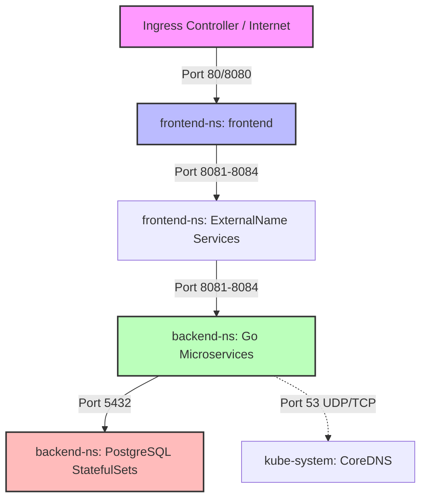

# Bezpieczeństwo i Zaawansowane Mechanizmy Orkiestracji

Dokument ten opisuje mechanizmy zabezpieczeń sieciowych, kontroli zasobów oraz zaawansowanego sterowania planowaniem podów w wielowęzłowym klastrze Kubernetes dla projektu **cinema-system**.

---

## 1. Ograniczenie wykorzystywanych zasobów (Zasoby i Limity)

Prawidłowe zarządzanie zasobami (CPU oraz RAM) na poziomie kontenerów jest kluczowym elementem stabilności i niezawodności klastra. Bez zdefiniowanych limitów jeden nieprawidłowo działający kontener (np. wyciek pamięci w jednej z mikrousług) może skonsumować całą wolną pamięć węzła fizycznego, doprowadzając do awarii sąsiednich podów (procesy zostaną zabite przez mechanizm Linux OOM-Killer).

W tym celu wdrożono trójwarstwową strategię kontroli zasobów:

### A. Definicje na poziomie kontenera (`resources.requests` i `resources.limits`)
W każdym z naszych podów (np. `user-service`, `booking-service` itp.) zdefiniowano:
*   **Requests (Żądania):** Minimalna gwarantowana ilość CPU i pamięci, którą Kubernetes rezerwuje dla kontenera na węźle podczas planowania. Zapewnia to stabilność działania aplikacji w warunkach normalnego obciążenia.
*   **Limits (Limity):** Nieprzekraczalny próg zużycia zasobów. Jeśli kontener spróbuje zużyć więcej pamięci RAM niż wynosi limit, zostanie natychmiast zrestartowany z błędem `OOMKilled`. Zużycie CPU powyżej limitu będzie dławione (throttling), co chroni inne aplikacje przed "zagłodzeniem".

### B. Domyślne wartości na poziomie przestrzeni nazw (`LimitRange`)
W przestrzeniach `frontend-ns` oraz `backend-ns` wdrożono obiekt typu `LimitRange`. Pełni on dwie funkcje:
1.  **Wymuszenie standardu:** Automatycznie wstrzykuje bezpieczne i predefiniowane wartości `requests` oraz `limits` do każdego nowo tworzonego kontenera, który sam takich limitów nie zadeklarował.
2.  **Ochrona przed błędami ludzkimi:** Gwarantuje, że żaden deweloper nie uruchomi w klastrze kontenera o nieograniczonym zapotrzebowaniu na zasoby.

### C. Globalne sufity przestrzeni nazw (`ResourceQuota`)
Na poziomie obu przestrzeni nazw nałożono globalne limity (`ResourceQuota`), które określają maksymalną dopuszczalną sumaryczną sumę żądań i limitów ze wszystkich uruchomionych podów w danej przestrzeni. Chroni to klaster fizyczny przed wyczerpaniem zasobów w sytuacji, gdy np. mechanizm Horizontal Pod Autoscaler (HPA) zacznie gwałtownie skalować pod z powodu nagłego skoku ruchu lub ataku typu DoS.

---

## 2. Polityka sieciowa (NetworkPolicy) i CNI Cilium

Domyślnie w Kubernetes sieć jest w pełni płaska – każdy pod może komunikować się z dowolnym innym podem, nawet w innej przestrzeni nazw. W architekturze produkcyjnej stanowi to ogromne zagrożenie bezpieczeństwa (np. przejęcie podatnego frontendu daje napastnikowi bezpośredni dostęp do baz danych).

Wykorzystując CNI **Cilium**, wdrożono rygorystyczny model bezpieczeństwa sieciowego oparty o zasadę najmniejszych uprawnień:



### A. Domyślna odmowa ruchu (Deny-by-Default)
Wdrożono izolację poprzez manifesty `default-deny-frontend` oraz `default-deny-backend`. Reguły te selekcjonują wszystkie pody w danej przestrzeni (`podSelector: {}`) i blokują jakikolwiek nieautoryzowany ruch wejściowy (Ingress) oraz wyjściowy (Egress).

### B. Precyzyjne zezwalanie na komunikację (Granular Allow Rules)
Stworzono dedykowane polisy zezwalające na ściśle zdefiniowane połączenia:
1.  **Frontend (`allow-frontend`):**
    *   *Ingress:* Zezwala na ruch przychodzący wyłącznie na port `8080` (np. z Ingress Controllera lub NodePort).
    *   *Egress:* Zezwala na ruch wyjściowy na serwer CoreDNS (`kube-system` port 53) w celu rozwiązywania nazw oraz ruch wyjściowy do przestrzeni `backend-ns` wyłącznie na porty API (`8081`, `8082`, `8083`, `8084`).
2.  **Mikrousługi Go (`allow-backends`):**
    *   *Ingress:* Zezwala na ruch wejściowy wyłącznie z przestrzeni `frontend-ns` na przypisane porty aplikacji.
    *   *Egress:* Zezwala na ruch wyjściowy do DNS oraz wyjściowy do baz danych PostgreSQL w tej samej przestrzeni (port `5432`).
3.  **Bazy danych (`allow-databases`):**
    *   *Ingress:* Zezwala na ruch na porcie `5432` **wyłącznie** od odpowiadającego podu aplikacji (np. `db-users` przyjmuje zapytania tylko z `user-service`).
    *   *Egress:* Pełna blokada ruchu wychodzącego. Baza danych nie potrzebuje inicjować żadnych połączeń zewnętrznych, co eliminuje ryzyko eksfiltracji danych w przypadku przejęcia bazy.

---

## 3. Mechanizmy sterujące planowaniem (Affinity / Anti-Affinity)

Aby zoptymalizować rozmieszczenie aplikacji w wielowęzłowym klastrze (w tym przypadku 3-węzłowym środowisku Minikube), wdrożono zaawansowane reguły planowania podów.

### A. Wysoka dostępność (Pod Anti-Affinity)
Dla wszystkich bezstanowych replik mikrousług oraz frontendu wdrożono politykę **Pod Anti-Affinity**:
```yaml
      affinity:
        podAntiAffinity:
          preferredDuringSchedulingIgnoredDuringExecution:
          - weight: 100
            podAffinityTerm:
              labelSelector:
                matchExpressions:
                - key: app
                  operator: In
                  values:
                  - user-service
              topologyKey: kubernetes.io/hostname
```
*   **Działanie:** Planista Kubernetes (Scheduler) unika umieszczania replik tej samej mikrousługi na tym samym węźle fizycznym.
*   **Cel:** Zapewnienie odporności na awarie (High Availability). Jeśli jeden z 3 węzłów klastra ulegnie awarii, usługa nadal będzie dostępna na innym węźle, gwarantując ciągłość działania systemu kinowego bez przestojów.

### B. Minimalizacja opóźnień sieciowych (Pod Affinity)
Każda mikrousługa Go intensywnie komunikuje się ze swoją dedykowaną bazą danych PostgreSQL. Aby zapobiec narzutowi sieciowemu związanemu z komunikacją między węzłami (cross-node traffic), wdrożono politykę **Pod Affinity**:
```yaml
        podAffinity:
          preferredDuringSchedulingIgnoredDuringExecution:
          - weight: 50
            podAffinityTerm:
              labelSelector:
                matchExpressions:
                - key: app
                  operator: In
                  values:
                  - db-users
              topologyKey: kubernetes.io/hostname
```
*   **Działanie:** Planista stara się umieścić pod mikrousługi (np. `user-service`) na tym samym węźle fizycznym, na którym działa odpowiadający mu pod bazy danych (np. `db-users-0`).
*   **Cel:** Przyspieszenie zapytań SQL. Dane przesyłane są lokalnie w obrębie jednego węzła (localhost/loopback), co redukuje opóźnienia i oszczędza pasmo sieciowe klastra.
